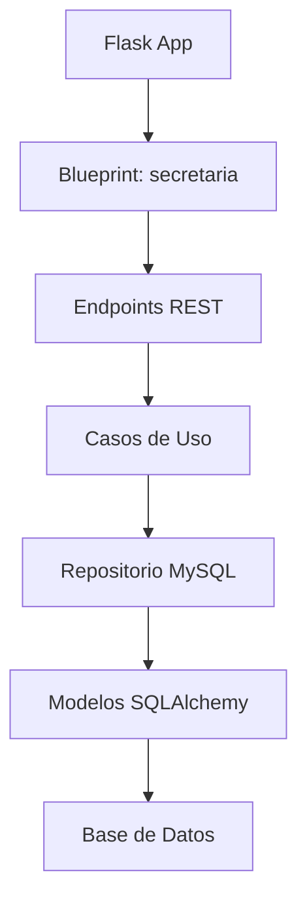
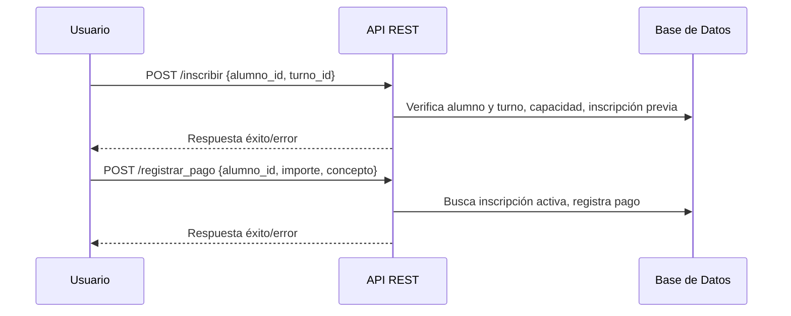

# workers-api (staging)

## Arquitectura y Estado Actual

### Descripción General
API RESTful para gestión de inscripciones y pagos en una academia, siguiendo DDD y Screaming Architecture. Desplegada en cPanel con Flask y SQLAlchemy.

---

## Diagrama de Componentes


---

## Endpoints Principales

- `GET /vlodeiro/secretaria/turnos_libres` — Consulta turnos y plazas libres
- `GET /vlodeiro/secretaria/turnos` — Lista todos los turnos
- `POST /vlodeiro/secretaria/inscribir` — Inscribe un alumno en un turno
- `POST /vlodeiro/secretaria/registrar_pago` — Registra un pago para un alumno inscrito

### Ejemplo de Inscripción
```json
{
  "alumno_id": 2,
  "turno_id": 1
}
```

### Ejemplo de Pago
```json
{
  "alumno_id": 2,
  "importe": 1000,
  "concepto": "Matricula"
}
```

---

## Estado de la Base de Datos

### Alumnos
```json
[1, 2, 3, ..., 50]
```

### Turnos
```json
[1, 2, 3, ..., 13]
```

### Inscripciones
```json
[
  {"id": 1, "alumno_id": 1, "turno_id": 1},
  {"id": 2, "alumno_id": 2, "turno_id": 1}
]
```

### Pagos
```json
[
  {"id": 1, "inscripcion_id": 2, "importe": 1000.0, "metodo": "Matricula"},
  {"id": 2, "inscripcion_id": 2, "importe": -100.0, "metodo": "Matricula"},
  {"id": 3, "inscripcion_id": 2, "importe": -100.0, "metodo": "Matricula"}
]
```

---

## Validaciones y Comportamiento
- No se permite inscribir dos veces al mismo alumno en el mismo turno.
- No se permite inscribir alumnos inexistentes o en turnos inexistentes.
- El campo `importe` en pagos acepta valores negativos (no validado).
- Los endpoints devuelven mensajes de error detallados en JSON.

---

## Flujo de Inscripción y Pago


---

## Ejemplo de Respuesta de Error
```json
{
  "error": "No se pudo inscribir al alumno",
  "debug": {"motivo": "alumno_ya_inscrito"}
}
```

---

## Seguridad y Despliegue
- Autenticación por API Key (`X-Api-Key`)
- Despliegue en cPanel, reinicio automático por `.cpanel.yml`
- Python 3.7, Flask 2.2.5, SQLAlchemy

---


---

## CI/CD y Despliegue Automatizado

### Flujo Propuesto
1. Push a rama `staging` o `main`:
   - Ejecuta tests y linting.
   - Si todo pasa, despliega automáticamente a cPanel usando Git Version Control.
   - Opcional: Notifica por email o Slack.
2. Despliegue en cPanel:
   - cPanel detecta el nuevo commit y permite reiniciar la app Python.
   - `.cpanel.yml` fuerza el restart y preserva `.htaccess`.

### Ejemplo de Workflow GitHub Actions
```yaml
name: CI/CD workers-api

on:
  push:
    branches: [staging, main]

jobs:
  test:
    runs-on: ubuntu-latest
    steps:
      - uses: actions/checkout@v4
      - name: Set up Python
        uses: actions/setup-python@v5
        with:
          python-version: '3.7'
      - name: Install dependencies
        run: pip install -r requirements.txt
      - name: Run tests
        run: pytest || echo "No tests found"
      - name: Lint
        run: flake8 . || echo "Lint warnings"

  deploy:
    needs: test
    runs-on: ubuntu-latest
    if: github.ref == 'refs/heads/staging'
    steps:
      - name: Deploy to cPanel (manual step)
        run: echo "Haz deploy en cPanel: Git Version Control → Deploy HEAD Commit"
```

### Recomendaciones
- Agrega tests en una carpeta `tests/` para validar endpoints y lógica.
- Configura notificaciones en GitHub Actions si lo deseas.
- Documenta el proceso en el README para el equipo.

---

## Referencias
- [openapi.yml](./openapi.yml)
- [requirements.txt](./requirements.txt)

---

> Documentación generada el 2025-08-05 por GitHub Copilot
